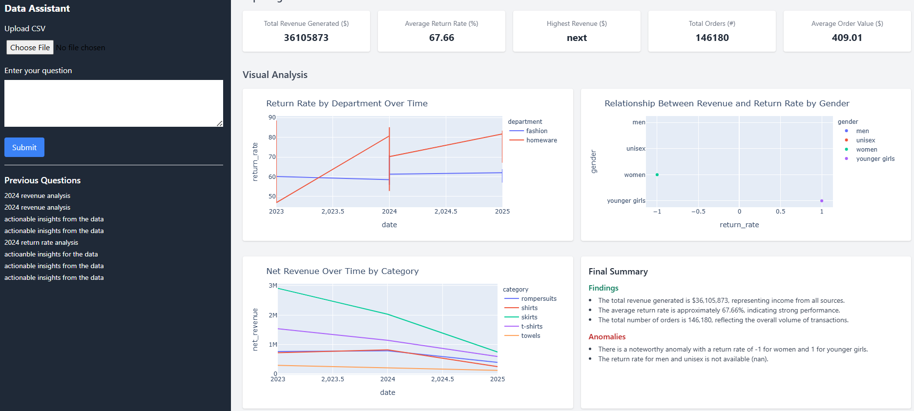

# ChatAnalytics-Bot




# Host app on AWS EC2 instance

step1: sudo apt update
step2: sudo apt install docker.io
step3: sudo apt install docker-compose
step4: sudo nano docker-compose.yml

    Use the below code

    ```
    version: '3.8'

    services:
        django:
            image: adityadocs2408/my-django-app:latest
            container_name: django
            restart: always
            expose:
            - "8000"
            volumes:
            - static_volume:/app/staticfiles  # Share static files

        nginx:
            image: adityadocs2408/nginx:latest
            container_name: nginx
            restart: always
            depends_on:
            - django
            ports:
            - "80:80"
            volumes:
            - static_volume:/app/staticfiles  # Same mount for Nginx

    volumes:
    static_volume:
    ```

step5: sudo systemctl start docker
step6: sudo systemctl enable docker
step7: sudo docker login -u username
step8: sudo docker-compose up --build

In Case of Error

step1: sudo docker ps -a
step2: sudo docker rm nginx django
step3: sudo docker rmi adityadocs2408/nginx adityadocs2408/my-django-app
step4: sudo docker-compose up --build
